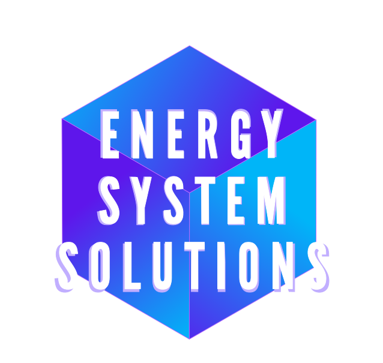
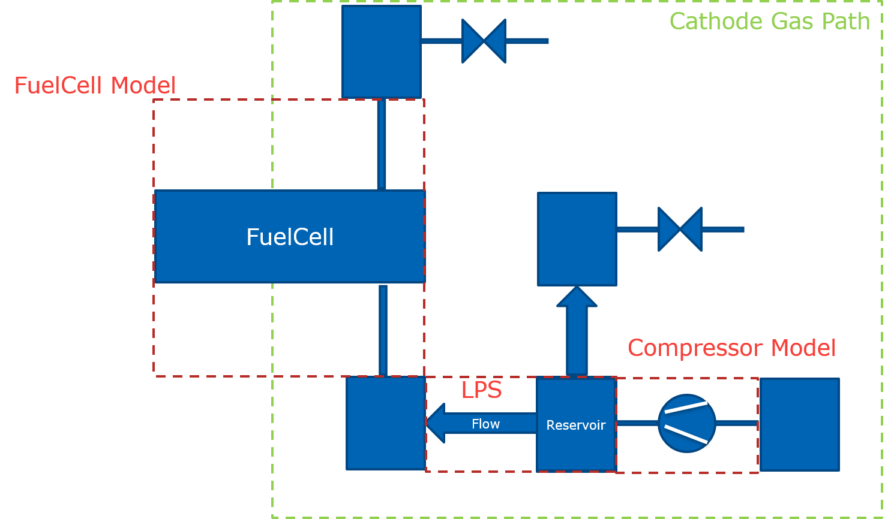
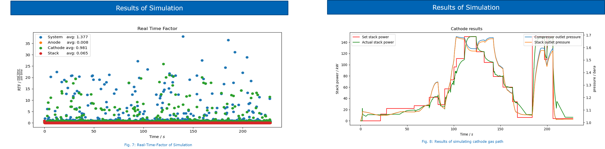
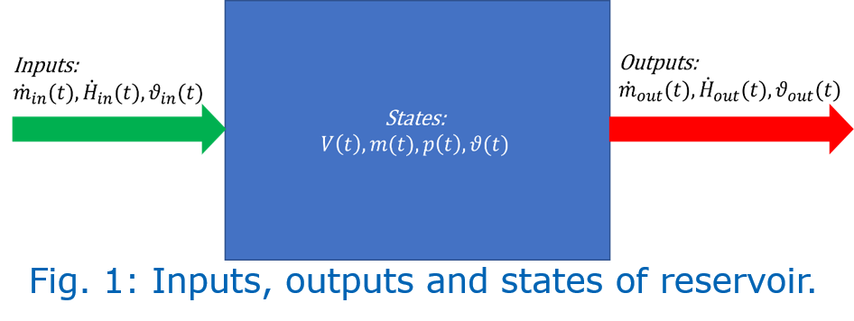
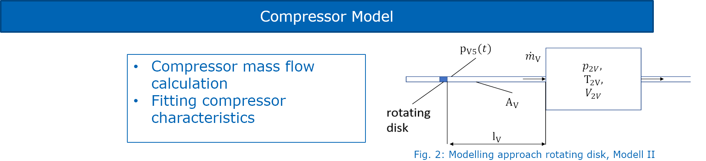
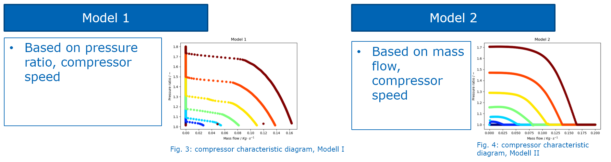

# Python Open Source Simulation Tool (POSST):

**Simulating Transient Systems Based on Controlled-Oriented Models (COM), Mean Value Modeling (MVM), Lumped Parameter System (LPS)**

### Project partner:

  
<a href="https://www.energy-system-solutions.de/">Energy System Solutions (ESS)1</a>

  
<a href="https://zbt.de/das-zbt/wissenschaftliche-abteilungen/brennstoffzellensysteme/">Hydrogen and Fuel Cell Center (ZBT)2</a>

[Become a project partner](mailto:florian.dennewitz@unitybox.de)

### Authors:
Florian Dennewitz (Maintainer)1,2, Leonora Kastrati (Maintainer)1, Niklas Nickig (Maintainer)2, Matthias Bahr (Contributor)2

---

## Abstract
This open-source simulation software enables real-time simulation of fuel cell system components without the use of mathematical solvers. Based on the Mean-Value-Modelling approach for transient process modelling, this software is web-based and addresses common challenges of existing simulation programs, such as high costs and lack of interoperability.

### Example of Cathode Path

  

### Results of Example

  

### Link to Websimulation
Here we provide a simulation environment on the Energy System Solutions Website:
https://www.energy-system-solutions.de/simulation. Feel free to test the simulation and the integrated controller of the ZBT.

---

## Keywords

- Simulation
- Open-source
- Python
- Black box modelling
- Fuel cell system

---

## Installation Guide
### Installation with pip
NOT AVAILABLE YET!

### Installation with GIT

If you prefer to install directly from the repository, follow these steps:

Clone the Repository:

    git clone https://github.com/ZBT-Tools/POSST.git

Navigate to the Project Directory:

    cd yourPath/POSST

Install Required Packages: Make sure you have a virtual environment set up (optional but recommended). Then install the required packages:

    pip install -r requirements.txt

Create Your Process: Follow the documentation in the repository to set up your process model.

Simulate Process: Use the provided simulation tools to run your process model. Check the usage examples in the documentation for guidance.

Additional Notes

    Ensure that you have Python installed (preferably Python 3.7 or higher).
    If you encounter any issues, check the issues section of the repository for troubleshooting.

Feel free to reach out if you have any questions or need further assistance!

---

## Contents

### 1. Modelling of Reservoirs
The reservoir model describes mass and enthalpy flow as well as temperature changes using ordinary differential equations.

  

### 2. Modelling of Flows
Assuming incompressible flow between reservoirs, mass flow is calculated with adaptations for potential backflow.

### 3. Modelling of Mixed Media
To calculate specific heat capacity and other properties, the gas composition is determined.

### 4. Modelling of the Compressor
The compressor is simulated using the “rotating disk” model. A Python library generates the compressor characteristic diagram.

  

A Python library generates the compressor characteristic diagram:

  

### 5. Modelling of the Fuel Cell
To reduce a 2-D + 1-D spatially resolved fuel cell model to a voltage model, several simplifications are necessary. By focusing only on the voltage model and ignoring certain sub-models, the complexity of the simulation can be significantly reduced while maintaining core performance characteristics relevant to voltage output.

---

## References
[1]	Dipl.-Ing. Sebastian Zahn, "Arbeitsspielaufgelöste Modellbildung und Hardware-in-the-Loop-Simulation von Pkw-Dieselmotoren mit Abgasturboaufladung," Fachbereich Elektrotechnik und Informationstechnik, Technische Universität Darmstadt, Darmstadt, 2012. 
[2]	L. Guzzella und C. Onder, Introduction to Modeling and Control of Internal Combustion Engine Systems, 2. Aufl. Berlin, Heidelberg: Springer Berlin Heidelberg, 2009. Zugriff am: 29. Oktober 2024. [Online]. Verfügbar unter: https://link.springer.com/book/10.1007/978-3-642-10775-7 
[3]	P. Virtanen et al., "SciPy 1.0: Fundamental Algorithms for Scientific Computing in Python," Nature Methods, Jg. 17, S. 261–272, 2020, doi: 10.1038/s41592-019-0686-2. 
[4]	S. Gößling, "2-D + 1-D ortsaufgelöste Modellierung von PEM-Brennstoffzellen," Fakultät für Ingeneuirwissenschaften, Abteilung Maschienenbau und Verfahrenstechnik, Universität Duisburg Essen, Duisburg, 2019. 

---

### Contact
- [Energy System Solutions (ESS), Bottrop, Germany](mailto:florian.dennewitz@unitybox.de)
- [Hydrogen and Fuel Cell Center (ZBT), Duisburg, Germany](mailto:f.dennewitz@zbt.de)

## Documentation
- [Docu](https://zbt-tools.github.io/POSST/html/POSST.html)